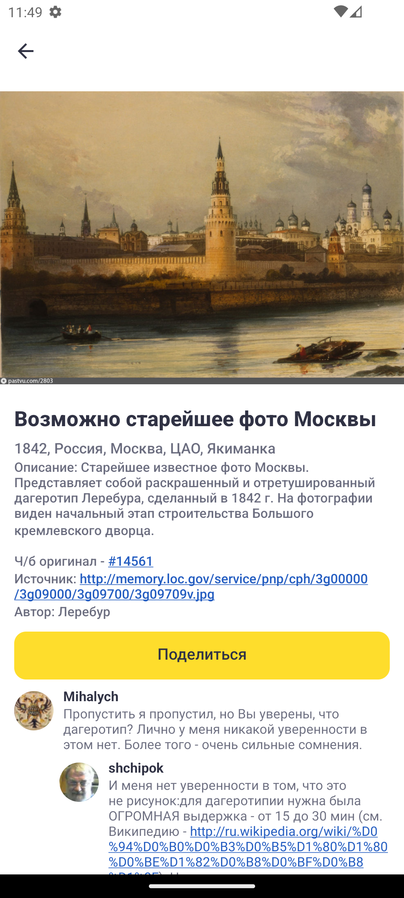
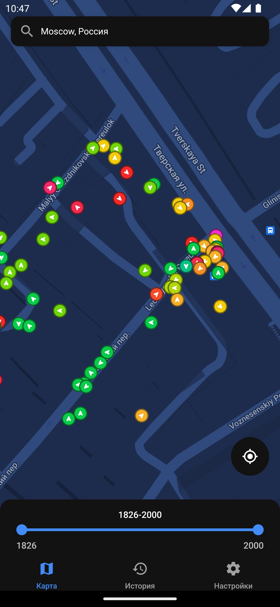
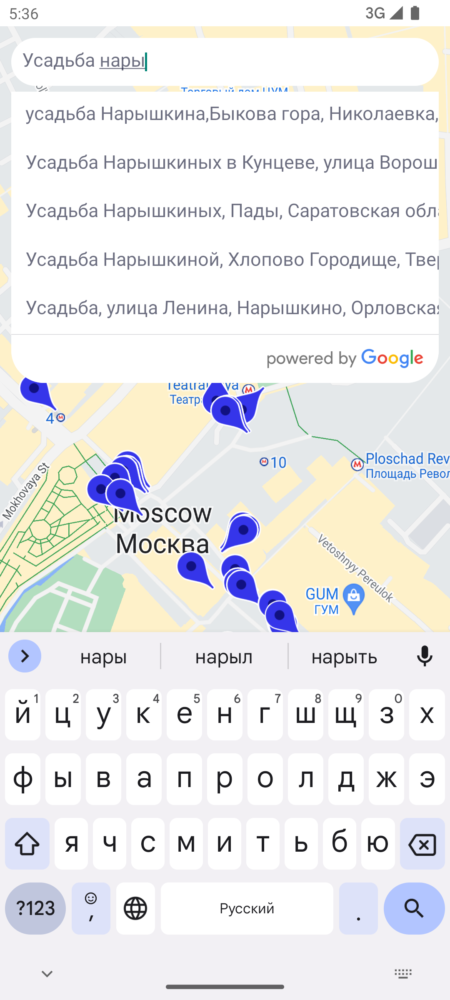
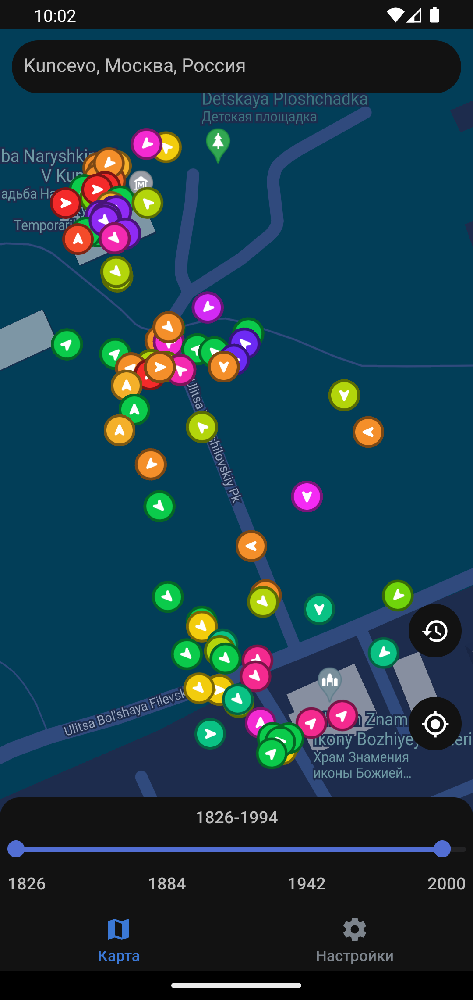
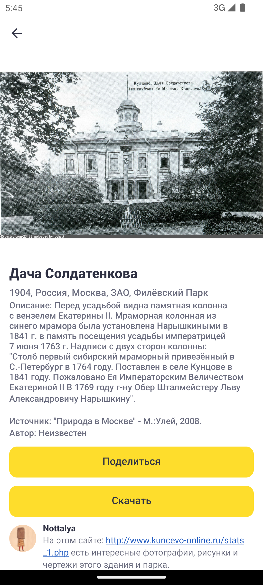
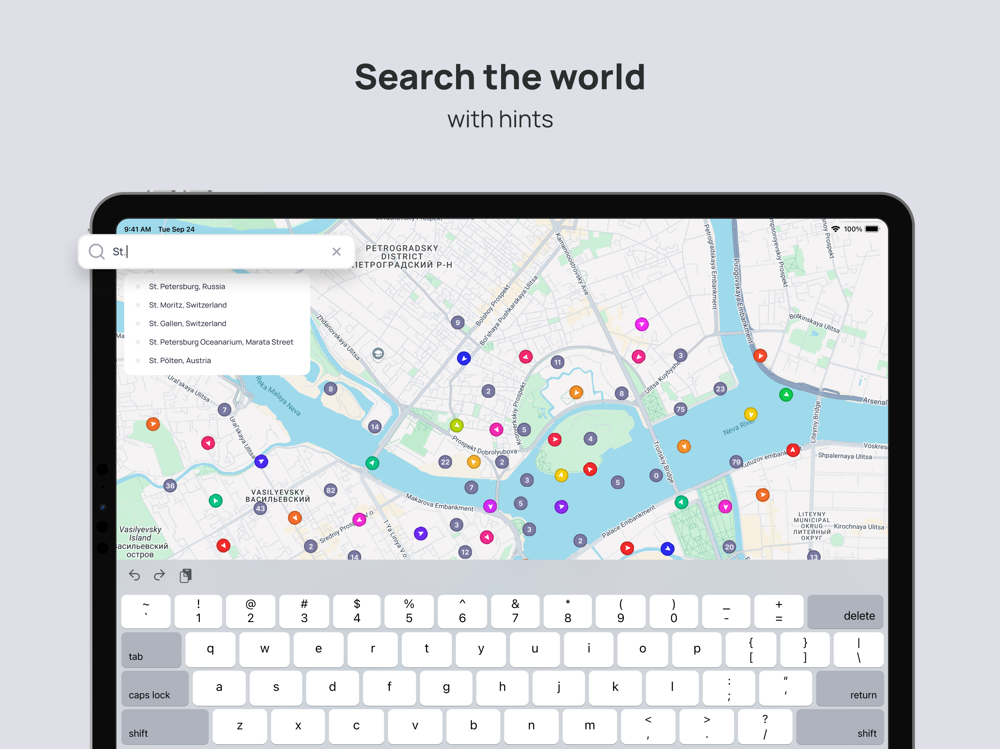
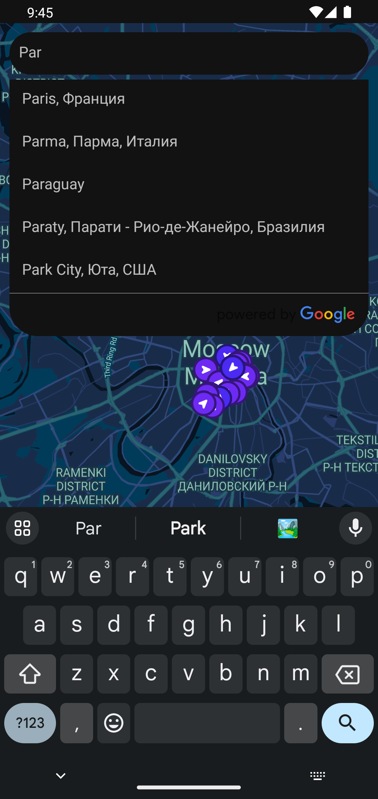
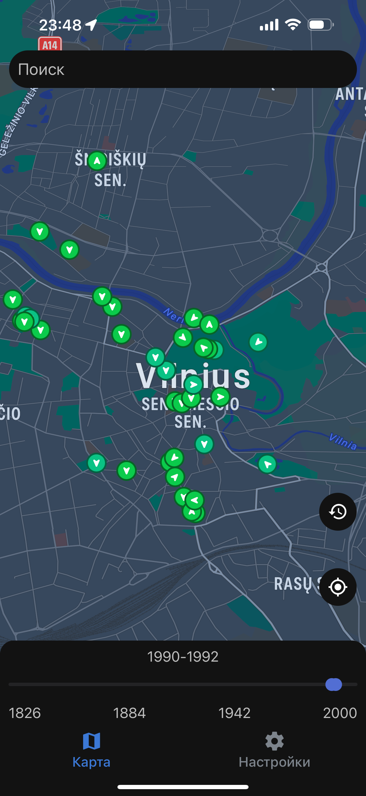
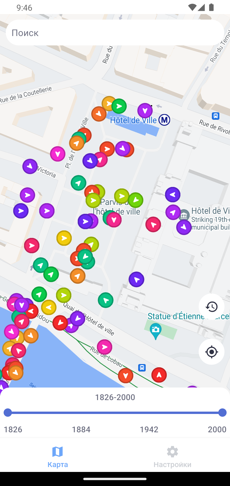
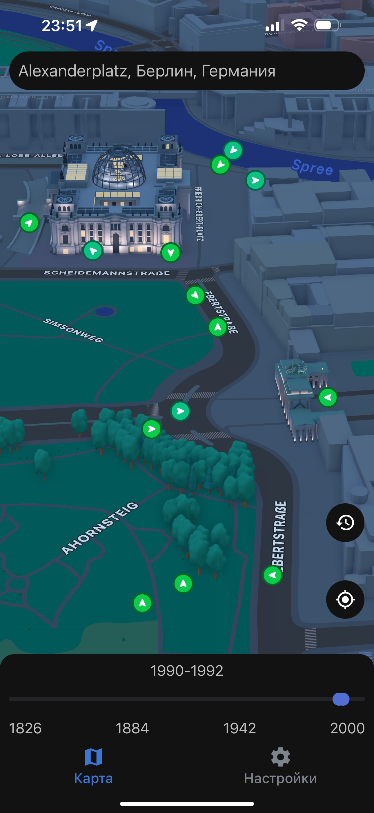

# PastVuApp

This application is a mobile version of the [PastVu
website](https://pastvu.com/), [here's its GitHub
page](https://github.com/PastVu/pastvu).

The app has been developed using ReactNative, TypeScript, and Expo, making it
compatible with both Android and iOS platforms. Currently only available for
Android on [Google
Play](https://play.google.com/store/apps/details?id=com.pelixpng.PastVuApp),
the iOS version will be released later.

PastVu is an online platform for gathering, geo-tagging, attributing and
discussing retro images. A look at the history of humanity habitat. The
platform's main goal is to make historical images more accessible to a wider
audience and to promote cultural heritage preservation. The platform is free to
use and allows users to explore historic images at location of interest, as
well as contribute images and information to the archive. You can read more
about the project [here](https://docs.pastvu.com/en/about). Platform source
[code](https://github.com/PastVu).

# Screenshots

  
   
  

  
   
  

  
   
  

  
   
  

# Resources Used

- [TaigaUI](https://taiga-ui.dev/) components were used in the design;
- [PastVu API](https://docs.pastvu.com/dev/api) is used to get photos;
- The map API is provided by the [Google Maps
  platform](https://developers.google.com/maps).

# Plans

- Add Yandex maps;
- Add English language support;
- Change the way place markers are displayed;
- Add place marker color customization;
- Add the news section;
- Add post-translating functionality;
- Add the settings reset button;
- Add cache management;
- Add animations;
- Publish the app to the App Store.

# License

GNU Affero General Public License (AGPL) v3 or later.  
See [LICENSE](https://github.com/pelixpng/PastVuApp/blob/master/LICENSE) for
the full license text.
