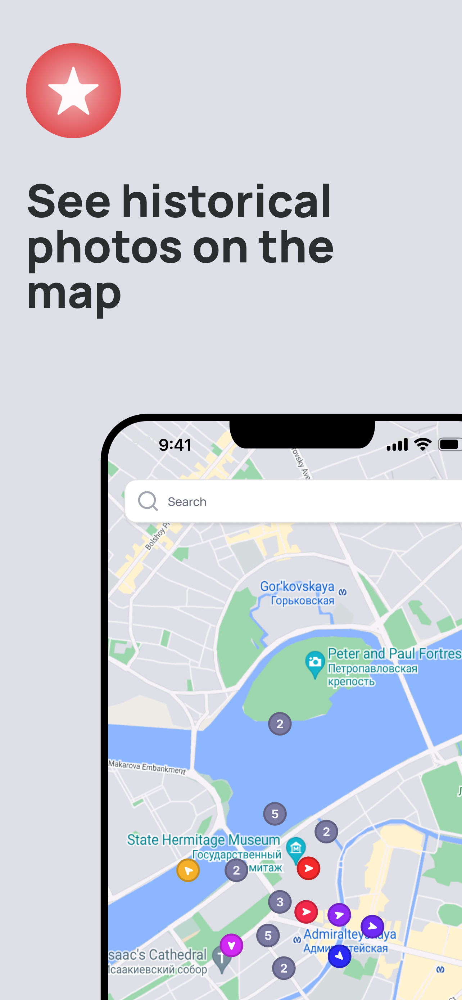
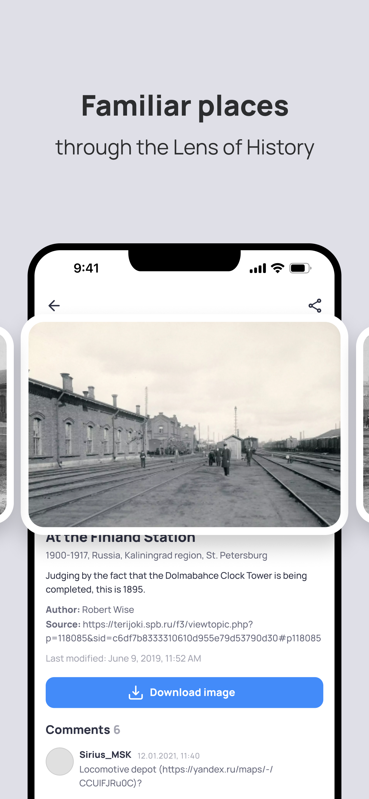

# PastVuApp

This application is a mobile version of the [PastVu
website](https://pastvu.com/), [here's its GitHub
page](https://github.com/PastVu/pastvu).

The app has been developed using ReactNative, TypeScript, and Expo, making it
compatible with both Android and iOS platforms. Available on [Google
Play](https://play.google.com/store/apps/details?id=com.pelixpng.PastVuApp) and [App Store](https://apps.apple.com/kz/app/pastvu-com/id6482482875).

PastVu is an online platform for gathering, geotagging, attributing and
discussing retro images. A look at the history of humanity habitat. The
platform's main goal is to make historical images more accessible to a wider
audience and to promote cultural heritage preservation. The platform is free to
use and allows users to explore historic images at location of interest, as
well as contribute images and information to the archive. You can read more
about the project [here](https://docs.pastvu.com/en/about). Platform source
[code](https://github.com/PastVu).

# System Requirements

- **Android:** 6.0 and up
- **iOS:** 13.4 and up
- **iPadOS:** Not supported currently
- **macOS:** 11.0 and up
- **visionOS:** 1.0 and up

# Features

  
   
  

  
   
  

# Resources Used

- [TaigaUI](https://taiga-ui.dev/) components were used in the design;
- [PastVu API](https://docs.pastvu.com/dev/api) is used to get photos;
- The map API is provided by the [Google Maps
  platform](https://developers.google.com/maps) and Apple Maps.

# Project team

1. [**Semyon Kuzmin**](https://github.com/pelixpng) - Application creator, development, testing.
2. [**Artem Kostyuchenko**](https://t.me/ArtemWaves) - Designer.

# License

GNU Affero General Public License (AGPL) v3 or later.  
See [LICENSE](https://github.com/pelixpng/PastVuApp/blob/master/LICENSE) for
the full license text.
