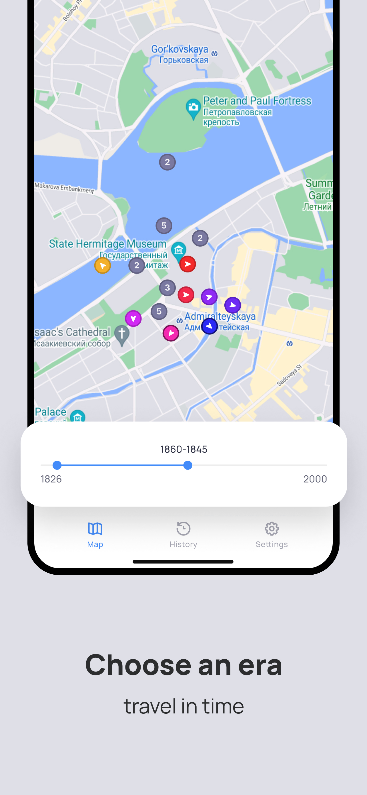
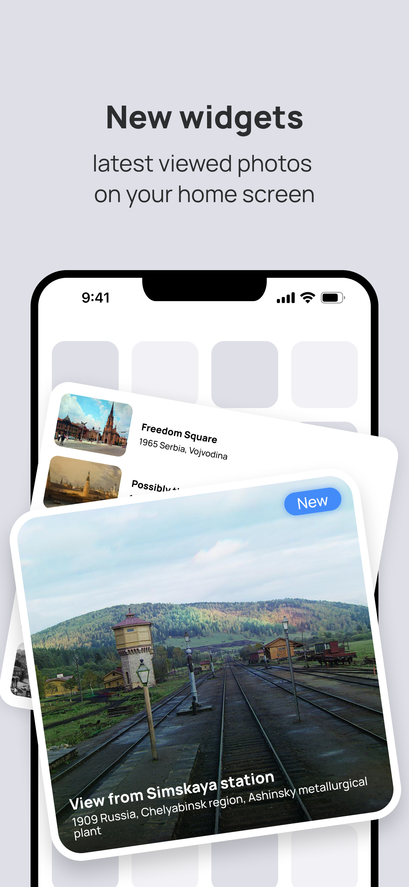

# PastVuApp


This application is a mobile version of the [PastVu
website](https://pastvu.com/).

It has been developed using ReactNative, TypeScript, and Expo, making it
compatible with both Android and iOS platforms. Currently only available for
Android on [Google
Play](https://play.google.com/store/apps/details?id=com.pelixpng.PastVuApp),
the iOS version will be released in the fall.

PastVu is an online platform for gathering, geo-tagging, attributing and
discussing retro images. A look at the history of humanity habitat. The
platform's main goal is to make historical images more accessible to a wider
audience and to promote cultural heritage preservation. The platform is free to
use and allows users to explore historic images at location of interest, as
well as contribute images and information to the archive. You can read more
about the project [here](https://docs.pastvu.com/en/about). Platform source
[code](https://github.com/PastVu).

# Screenshots

<p align="center">
  
   
  
</p>

<p align="center">
  
   
  
</p>

# Resources Used

[TaigaUI](https://taiga-ui.dev/) components were used in the design.  
[PastVu API](https://docs.pastvu.com/dev/api) is used to get photos.
The map API is provided by the Google Map
[platform](https://developers.google.com/maps).  

# How to start?

1. Generate your key to work with Google Maps API.
   [Instruction](https://docs.expo.dev/versions/latest/sdk/map-view/#deploy-app-with-google-maps)
2. Clone and open this repository.
3. In the `SRC` folder, open the `app.json` file. Paste your key into the line
   `android.config.googleMaps.apikey`.
4. Generate your development build.
   [Instruction](https://docs.expo.dev/develop/development-builds/create-a-build/)
5. Install the development build on your device or emulator and run the
   command: 

    ```
    npx expo start --dev-client
    ```
